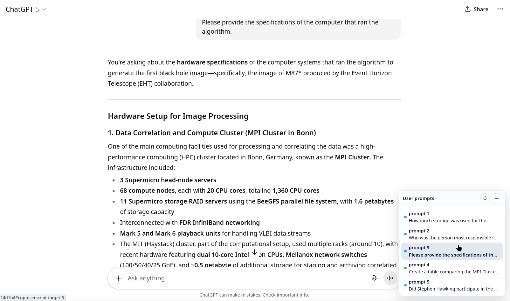

## ChatGPT User Script

A lightweight userscript that adds a floating "Prompts" navigator to ChatGPT conversations. It lists your user messages, lets you jump to any prompt with one click, briefly highlights the target, and keeps the active item in sync as you scroll.

### Features
- **Floating panel**: Bottom‑right card, encapsulated in a Shadow DOM to avoid style clashes.
- **One‑click jump**: Smooth‑scroll to any user prompt; target flashes briefly.
- **Active sync**: IntersectionObserver marks the most visible prompt as active.
- **Auto‑update**: MutationObserver rebuilds the list on content changes.
- **SPA aware**: Detects route changes in ChatGPT and refreshes automatically.
- **Manual controls**: Refresh (↻) and Collapse (—) buttons.
- **Zero dependencies**: `@grant none`; no external network/storage access.

### Works on
- `https://chatgpt.com/c/*`
- `https://chatgpt.com/g/*`

### Install
Use any userscript manager (Tampermonkey, Violentmonkey, etc.).

- **Tampermonkey**
  1. Open the Tampermonkey dashboard.
  2. Utilities → Import from file → select `chatgpt.userscript.user.js` → Install.
     - Alternatively: Create a new script and paste the file contents, then Save.

- **Violentmonkey**
  1. Open the Violentmonkey dashboard.
  2. Click + New → paste the contents of `chatgpt.userscript.user.js` → Save.
     - Alternatively: Use “Install from URL” if you host the raw file yourself.

### Use
1. Go to a ChatGPT conversation page (`/c/` or `/g/`).
2. A small "User turns" card appears at the bottom‑right.
3. Click an item to jump; it flashes briefly. The active item updates as you scroll.

### Configuration
- **Selector**: Targets are matched via `data-testid` and `data-turn` attributes. If ChatGPT’s DOM changes, update `TARGET_SELECTOR` in `chatgpt.userscript.user.js`.
- **Styling**: Tweak the styles inside the script; the UI is isolated by Shadow DOM.

### Privacy & security
- Runs locally in your browser via a userscript manager.
- No external requests; does not transmit your data.
- Uses standard web APIs (MutationObserver, IntersectionObserver, smooth scrolling).

### Compatibility notes
- ChatGPT’s DOM may change. If the list stops populating, adjust the selector.
- High z‑index keeps the panel visible; use Collapse (—) if it overlaps other UI.

### Development
- Source: `chatgpt.userscript.user.js`
- After edits, bump the `@version` header so your manager picks up updates.

### License
No license specified. Consider adding a license if you plan to share or reuse.
